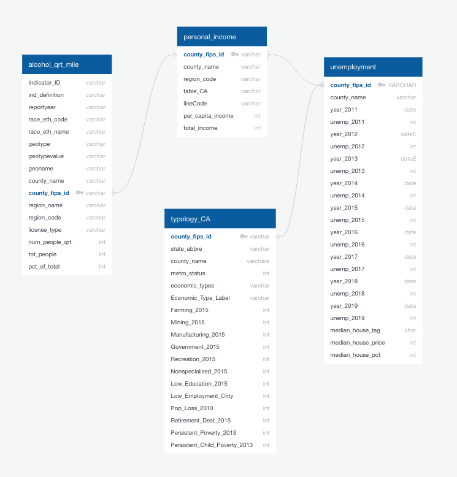
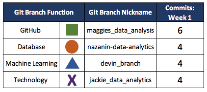

# Liquor Licences and Close-Proximity Population Demographics  


## Overview

The CDC publishes a fascinating dataset detailing the racial/ethic percentages of persons living within 0.25 miles of an establishment with a liquor license.   


Layering additional demographic data including income levels, proverty indicators

This project **hopes to answer the following questions**:

* Is there a racial or ethnic population more likely to live within a quarter mile of a liquor licensed establishment?
* What is the racial or ethnic breakdown of populations within a quarter mile of a liquor licensed establishment? 
* Is there a correlation between income an dproximity to an alcohol outlet?

Ultimately, the goal is to build a machine learning model (using linear regression) that can **predict the likelihood of a liquor outlet is within a quarter-mile of a person's home based on their race and location**. 

## Data Source
There are 4 data sources used to build this model:

1. Population breakdown by Race/Ethnicity within a quarter mile of an alcohol outlet.  The data was captured in 2014 an published by CDC.
2. 


 
This dataset focuses on California and its County-level information.  

Additional Data sets include:


## Database

First step in creating this predictive model and getting the answers we are looking for, is to import the raw data into SQL and create a schema outlining the table structure and interconnections.

This is done using **PostGres** and **SQL**; ERD schmatic below: 



Once the team is ready to start analyzing, the data is connected directly to a **Python** Notebook to be read in. At which point we are ready to clean, transform, and preprocess our dataset.  *That's where the fun begins!*

The following **technologies**, modules, and functions within **Python** will be used to read in, prepare and transform the data: 

* pandas
* sklearn
	* model_selection: ```train_test_split```
	* preprocessing: ```StandardScaler``` 
	* preprocessing: ```OneHotEncoder```


## Machine Learning Model
Once the dataset is cleaned and transformed, we can start compiling, training, and evaluating the model.  A **Linear Regression model** will be employed as the predict outcome of this model will be in the form of a **continuous dependent variable**.


## Dashboard Presentation
The dashboard will be built using **Tableau**.  Visualizations to tell this story will include graphs, heat maps and interactive predictions. 

*Be on the look out for our findings in the coming weeks!*


## GitHub and Communication Protocol

### GitHub
In order to accomplish this massive task, this team will be utilizing GitHUb to collaborate.  In addition to our main (or master branch), this repository contains the following branches: 

* Machine Learning (Triange): ```devin_branch```
* Technology (X): ```jackie_data_analytics```
* GitHub (Square): ```maggies_data_analysis```
* Database (Circle):```nazanin-data-analytics```

Each week, our team will have a minimum of 4 commits per member.  
For Week 1:




### Communication Protocol
In addition to utilizing GitHub and our Slack channel, this team will meet weekly during and/or before normal class times on **Monday and Wednesday evening** as well as via zoom as needed.

Each team member has a role to play and for **Week 1** they are: 

* **Circle Role (Database)**:  Nazanin Tavakoli
* **Triangle Role (Machine Learning)**  Devin Hollister 
* **Square Role (GitHub)**: Maggie McPhail 
* **X Role (Technology)**: Jackie Chitsanga

Once a team member is ready with their portion of the assignment, the Square will be notified, create a pull request to merge to the main and resolve any resulting conflicts. The rest of the team will be notified via Slack when to pull the updated main branch.
   

